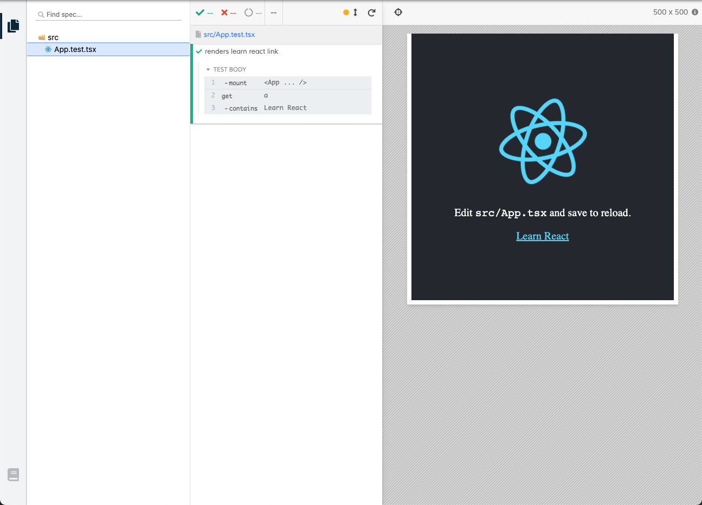

## Testing React with Cypress and Vite

As announced recently on the [Cypress blog](https://www.cypress.io/blog/2021/04/06/introducing-the-cypress-component-test-runner/), Cypress 7.0 comes with a dedicated component testing runner. Most users will opt for the battle tested [webpack dev server](https://www.cypress.io/blog/2021/04/06/cypress-component-testing-react/). Some users like to be on the bleeding edge, though, and for that we also have an experimental ES modules dev server powered [Vite](https://vitejs.dev/).

This article will show you how to set up Cypress and Vite. You can find the [source code here](https://github.com/lmiller1990/cypress-react-vite-demo).

## Creating a React Project

The easiest way to get started is by scaffolding a new project using Create React App. Let's do so, and include TypeScript for good measure:

```sh
yarn create react-app react-cypress-vite --template typescript
```

That's all it takes to create the initial React project.

## Install Cypress

Next we need a few dependencies. Those are Cypress, it's React adapter, and the Vite Dev Server:

```sh
yarn add cypress @cypress/react @cypress/vite-dev-server vite --dev
```

Now we have a project and the correct dependencies, we need to do a tiny bit of configuration.

## Configuring Cypress and Vite

Next we need a little bit of configuration. Since the Cypress component testing runner is dev server agnostic, we need to tell it to use Vite. Create `cypress/plugins/index.js` and add the following:

```js
const { startDevServer } = require('@cypress/vite-dev-server')

module.exports = (on, config) => {
  on('dev-server:start', (options) => startDevServer({ options }))

  return config
}
```

Finally, we need to tell Cypress where to find our tests and components. I'm going to go with the default that Create React App ships with: components and tests in `src`, test files ending with `.test.tsx` or `.spec.tsx`.

```json
{
  "testFiles": "**/*{test,spec}.{ts,tsx}",
  "componentFolder": "src"
}
```

## Writing a Test with Cypress

Finally, let's update the default test. Create React App ships with [Testing Library](https://testing-library.com/). While it is possible to use Testing Library selector and assertion syntax with Cypress, I'm going to use the default Cypress driver, which has a slightly more ergonomic API - no need to explicitly `await` DOM updates, for example. 

The default test written using Cypress looks like this:

```tsx
import React from 'react';
import { mount } from '@cypress/react';
import App from './App';

it('renders learn react link', () => {
  mount(<App />);
  cy.get('a').contains('Learn React');
});
```

You can run the test in two ways.

## Interactive Mode

The main way you interact with Cypress is via interactive mode. This let's you see the component and how it behaves as you update the component and tests. Run Cypress interactively with `yarn cypress open-ct`. It looks like this:



Try changing the component or test - it's re-executed almost immediately. Vite is fast!

## Run Mode

Sometimes you just want to run all the tests without seeing them rendering. This is especially useful in a CI environment. You can do this using `yarn cypress run-ct`, which runs the tests in a headless browser by default, printing the results to the terminal:


```sh
===================================================================================

  (Run Finished)


       Spec                             Tests  Passing  Failing  Pending  Skipped
  ┌───────────────────────────────────────────────────────────────────────────────┐
  │ ✔  App.test.tsx            114ms        1        1        -        -        - │
  └───────────────────────────────────────────────────────────────────────────────┘
    ✔  All specs passed!       114ms        1        1        -        -        -
```

You can find the [source code here](https://github.com/lmiller1990/cypress-react-vite-demo).
